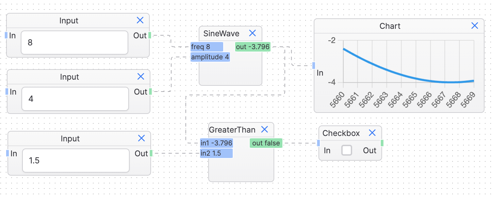

[](https://github.com/rracariu/logic-mesh/actions/workflows/main.yml)
[](https://github.com/rracariu/logic-mesh/blob/master/LICENSE)
[](https://crates.io/crates/logic-mesh)
[](https://www.npmjs.com/package/logic-mesh)

# Logic Mesh
A logic engine that is fully async, dynamic, and reactive written in Rust.



## Possible applications
Logic Mesh started as a hardware control engine, but the scope expanded to anything that requires a reactive and dynamic evaluation engine. 
It is designed to be used in a variety of applications, from hardware controls, games to web servers. It is designed to be fast, efficient, and easy to use.

The included WASM support allows it to be used in web applications, with the option to use the same codebase for both the frontend and backend.

## Features
- Fully async and reactive
- WASM support
- Uses Tokio for async runtime
- The API is simple enough to be used in a variety of applications
- A low code editor is included as an example of how Logic Mesh can be used
- A growing library of built-in blocks
- Extensible with custom blocks, either in Rust or JavaScript when running in a WASM environment

## UI Editor
There is a sample low code editor that is built on top of Logic Mesh, which can be found [here](https://rracariu.github.io/logic-mesh/). It serves as an example of how Logic Mesh can be used, and as
a simple way to experiment with the Logic Mesh engine.

## NPM Package
The engine is also available as an NPM package, which can be found [here](https://www.npmjs.com/package/logic-mesh).
The NPM package is a thin wrapper around the WASM package, and it can be used in a Node.js environment.

## Examples

The following examples are written in Rust.

```rust
// Init a Add block
let mut add1 = Add::new();
// Init a SineWave block
let mut sine1 = SineWave::new();

// Se the amplitude and frequency of the sine wave
sine1.amplitude.val = Some(3.into());
sine1.freq.val = Some(200.into());
// Connect the output of the sine wave to the first input of the add block
connect_output(&mut sine1.out, add1.inputs_mut()[0]).expect("Connected");

// Init another SineWave block
let mut sine2 = SineWave::new();
sine2.amplitude.val = Some(7.into());
sine2.freq.val = Some(400.into());

// Connect the output of the sine wave to the second input of the add block
sine2
	.connect_output("out", add1.inputs_mut()[1])
	.expect("Connected");

// Init a single threaded engine
let mut engine = SingleThreadedEngine::new();

// Schedule the blocks to be run
engine.schedule(add1);
engine.schedule(sine1);
engine.schedule(sine2);

// Run the engine
engine.run().await;
```

