# External Integration API

> **Design note.** Describes the protocol-agnostic integration layer in `logic-mesh`.
> Motivated by issue [#3](https://github.com/rracariu/logic-mesh/issues/3) and implemented
> by PR [#13](https://github.com/rracariu/logic-mesh/pull/13).

---

## 1. Motivation

`logic-mesh` provides execution and dataflow: blocks exchange values with other blocks. It has no
opinion about how values enter or leave the graph, so each embedding application supplies its own
bridge to the outside world.

Left unaddressed, that produces three problems:

1. **Per-protocol block proliferation.** Without a shared contract, each transport (MQTT, HTTP,
   WebSocket, an in-process simulator) needs its own hand-written blocks for each operation —
   *N protocols × M operations* of near-duplicate code.
2. **Integration concerns leak into the block registry.** Blocks that exist only to move data across
   a boundary must be registered like ordinary computation blocks, and their configuration ends up
   modelled as engine pins even when it is inert with respect to the dataflow.
3. **Ambiguous write ownership.** When a value can be set both by the program and by an external
   agent through the same pin, the precedence between the two is implicit and racy.

The design below addresses these with a single trait, three generic blocks, engine-managed
lifecycle, and runtime management messages.

## 2. Goals and non-goals

**Goals**

- One contract covering the three primitive external operations: subscribe, publish, request.
- Protocol implementations live **outside** the core crate; the engine never learns a protocol.
- Bindings are data, not code: a block names its connector and address through ordinary pins, so
  rebinding is a pin write and the binding serializes with the program.
- Deterministic lifecycle: connectors start before blocks run and stop on shutdown or reset, with
  bounded waits so a faulty implementation cannot wedge the engine.
- Connectors can be added and removed on a running engine.
- Connectors are implementable from JavaScript when running under wasm.

**Non-goals**

- Shipping concrete protocol adapters in the core crate.
- Exactly-once delivery. The cancellation model makes at-least-once the achievable guarantee for
  outbound paths (§7).
- Ownership arbitration between multiple engines sharing one connector name (§10).

## 3. Design overview

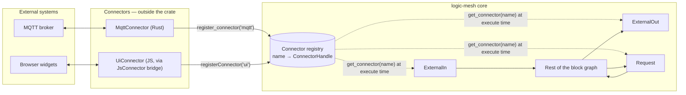

A block resolves its connector *by name* from a process-wide registry at execution time, and selects
its target *by address*. Both are ordinary `Str` pins. Adding a protocol means implementing one
trait and registering it under a name; no core code changes and no new block types.

## 4. Core abstractions

### 4.1 The `Connector` trait — `src/base/connector.rs`

```rust
pub trait Connector: Send + Sync {            // no Send/Sync bounds on wasm32
    fn start(&self) -> ConnectorFuture<'_, ()> { /* default: no-op */ }
    fn stop(&self)  -> ConnectorFuture<'_, ()> { /* default: no-op */ }

    fn subscribe(&self, address: &str) -> ConnectorFuture<'_, ValueStream>;
    fn publish(&self, address: &str, value: Value) -> ConnectorFuture<'_, ()>;
    fn request(&self, address: &str, value: Value) -> ConnectorFuture<'_, Value>;
}
```

Five contract rules shape everything downstream:

| Rule | Consequence |
|---|---|
| Every method takes `&self` | One handle is shared by every block bound to it; mutable connection state needs interior mutability. |
| **Subscriptions are RAII** — `ValueStream` is a boxed `Stream<Item = Result<Value, ConnectorError>>`, and dropping it *is* the unsubscribe | There is no `unsubscribe` method. Implementations release protocol subscriptions from the stream's `Drop`. |
| **Cancellation is normal** — any returned future may be dropped mid-flight, because block actors race `execute()` against their mailbox | Dropping must leave the connector usable; a dropped `request` should abort the in-flight operation where the protocol allows. |
| `start` must be restartable; `stop` must end every outstanding stream (yield `None`) | Stream holders observe the end and re-subscribe after a restart. |
| IO loops belong to the connector — spawn from `start`, wind down in `stop` | Engine **pause** does not pause connector tasks; it only stops driving block actors. |

### 4.2 The registry

`register_connector(name, handle)` · `unregister_connector(name)` · `get_connector(name)` ·
`list_connectors()`

- Process-wide: an `RwLock<HashMap>` natively, a `thread_local RefCell` on wasm.
- `ConnectorHandle` wraps `Arc<dyn Connector>` natively and `Rc<dyn Connector>` on wasm. The pointer
  type is chosen in exactly one place, so call sites never name it and a change of threading model
  touches one type.
- The registry is the single source of truth. An engine tracks only connector *names*; the handles
  live here, and blocks resolve against the same map.

### 4.3 Error model — `src/base/error/connector.rs`

| Variant | Raised when |
|---|---|
| `NotFound { name }` | lookup of an unregistered name |
| `AlreadyRegistered { name }` | registering a duplicate name |
| `Subscribe { address, detail }` | `subscribe` failed, or a stream item was an error |
| `Publish { address, detail }` | `publish` failed |
| `Request { address, detail }` | `request` failed |
| `Timeout { address, millis }` | an `ExternalOut` or `Request` block's deadline elapsed |
| `Transport(String)` | connection-level failure outside a specific operation |

Each variant carries the address, so callers can identify the failing route without parsing display
strings. Inside blocks these surface as `BlockState::fault(...)`.

### 4.4 The external blocks — `src/blocks/external/`

| Block | Pins | Fires when | Faults when |
|---|---|---|---|
| **`ExternalIn`** | `connector: Str`, `address: Str` → `out: Null` (any kind) | every value the subscription yields is set on `out` | no such connector · subscribe error · stream error · stream ended |
| **`ExternalOut`** | `in: Null`, `connector`, `address`, `timeout: Number` (ms, default 5000) → `out` (echo of the published value) | a **fresh** non-`Null` `in` value | no such connector · publish error · timeout |
| **`Request`** | `in: Null`, `connector`, `address`, `timeout: Number` (ms, default 5000) → `out` (the response) | a **fresh** non-`Null` `in` value | no such connector · request error · timeout |

Shared behaviour:

- Rewriting `connector`, `address` or `timeout` alone **re-binds without re-firing**. `ExternalIn`
  drops its stream and re-subscribes; `ExternalOut` and `Request` do not resend their cached value.
- A value arriving before the binding pins resolve is **held** and sent once they do.
- `ExternalIn` re-subscribes automatically after a stream ends, throttled by the engine's polling
  interval, so it recovers on its own once a connector restarts.
- "Fresh" means the `in` cache actually changed. Re-emitting an identical value does not fire, which
  is consistent with value flow elsewhere in the engine, and a config-only pin write cannot re-send a
  cached value. Values arriving through the engine's pin-write path — a UI write, or a saved
  program's initial value on load — count as fresh just like linked value flow.

### 4.5 Engine-managed lifecycle — `src/tokio_impl/engine/connectors.rs`

Both engines — single- and multi-threaded — hold a `Vec<String>` of managed connector names and
share the same free functions, so their semantics are identical by construction.

| Engine event | Effect on managed connectors |
|---|---|
| `add_connector(name, handle)` before `run` | registered and added to the managed list |
| `run()` | `start()` awaited on each **before any block actor makes progress** |
| `Shutdown` | `stop()` awaited; connectors **stay registered and managed**, so a re-run restarts them |
| `Reset` | **unregister first**, then `stop()`; managed list cleared |
| `AddConnectorReq(name)` while running | resolve name → `start()` → add to list; on failure `stop()` is awaited and the name stays registered so a retry is possible |
| `RemoveConnectorReq(name)` while running | remove from list → unregister → `stop()` |
| `ListConnectorsReq` | returns the managed names |
| engine dropped | unregister without awaiting `stop`, since `Drop` cannot await |

Every `start`/`stop` await is bounded by `CONNECTOR_LIFECYCLE_TIMEOUT_MILLIS` (5000 ms); a connector
that exceeds it is logged and skipped rather than treated as fatal.

Unregistering before stopping on `Reset` and `RemoveConnectorReq` is deliberate: it guarantees no
block can `get_connector` a connector that is mid-shutdown.

### 4.6 Runtime management

Connector handles never travel in engine messages — they are not `Send` on every target — so the
running-engine path is *register the handle, then attach it by name*. Three message pairs cover it:
`AddConnectorReq`/`Res`, `RemoveConnectorReq`/`Res`, and `ListConnectorsReq`/`Res`. The wasm
`EngineCommand` mirrors them as `addConnector`, `removeConnector`, and `listConnectors`.

Route and subscription management needs no dedicated messages: re-pointing an external block is a
write to its `connector` / `address` pins over the existing `WriteBlockInputReq` path, and
`ExternalIn` observes the change and re-subscribes.

### 4.7 JavaScript connectors on wasm — `src/wasm/js_connector.rs`

The module-level `registerConnector(name, obj)` export (with `unregisterConnector`,
`connectorRegistered`, and `connectorIs` — which reports whether the live registry entry under a
name is exactly a given JS object, the ownership check façades like `defineJsBlocks` rely on —
beside it, and an `engine.registerConnector` convenience for pre-run setup)
accepts a plain JavaScript object exposing `subscribe`, `publish`, and `request` (required) plus
`start` and `stop` (optional). Each method may return a
value or a Promise. Subscription delivery is callback-based:

| JS call | Rust side observes |
|---|---|
| `callback(value)` | `Some(Ok(value))` |
| `callback(undefined, detail)` | `Some(Err(ConnectorError::Subscribe))`; the stream stays live |
| `callback()` — no arguments | `None`; the stream has ended |
| return value of `subscribe` | an unsubscribe function, invoked from the stream's `Drop` |

Because a zero-argument call ends the stream, an accidentally-`undefined` value is indistinguishable
from a deliberate end-of-stream.

## 5. Connector lifecycle

### 5.1 From the engine's point of view

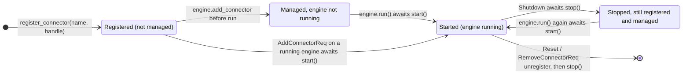

A connector is retained on `Shutdown` so that `run()` can be called again with the same bindings,
which is why `start` must tolerate being called on an already-stopped connector. Dropping the engine
leaves any state: its managed connectors are unregistered without awaiting `stop`, since `Drop`
cannot await (see the table in §4.5).

### 5.2 Attaching to a running engine

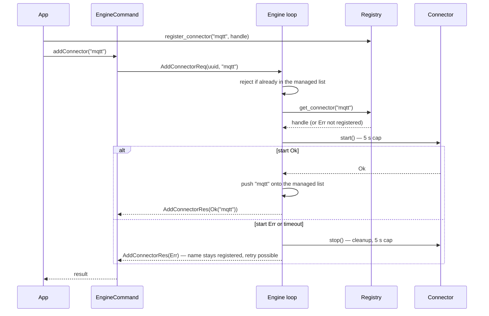

A failing `start` may already have spawned IO tasks, or may complete after the timeout cancelled the
await, so the cleanup `stop` runs before the error is returned; nothing else would ever stop a
connector the engine is not tracking.

### 5.3 `ExternalIn` — subscription states within a block

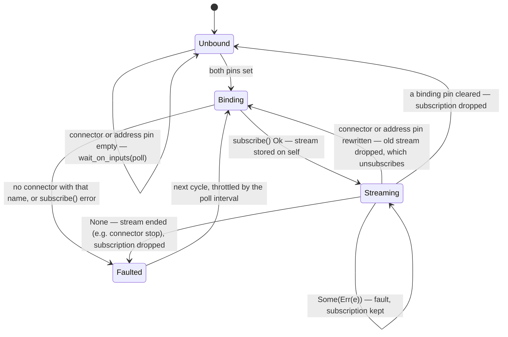

Two properties make this safe under cancellation:

- While streaming, `execute()` races `stream.next()` against `sleep(poll)`, so pin rewrites are
  noticed even when the external source is quiet.
- The stream is owned by `self`, so a block actor cancelling `execute()` leaves the subscription
  intact, and channel-backed streams lose no values.

### 5.4 `ExternalOut` and `Request` — the pending-value machine

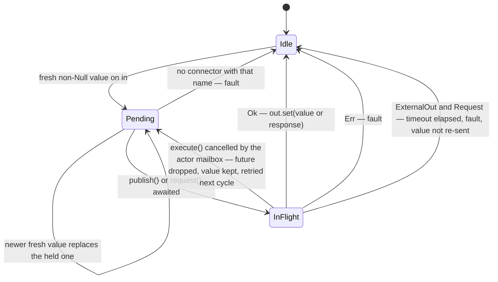

## 6. Data flows

### 6.1 Inbound: external system → graph

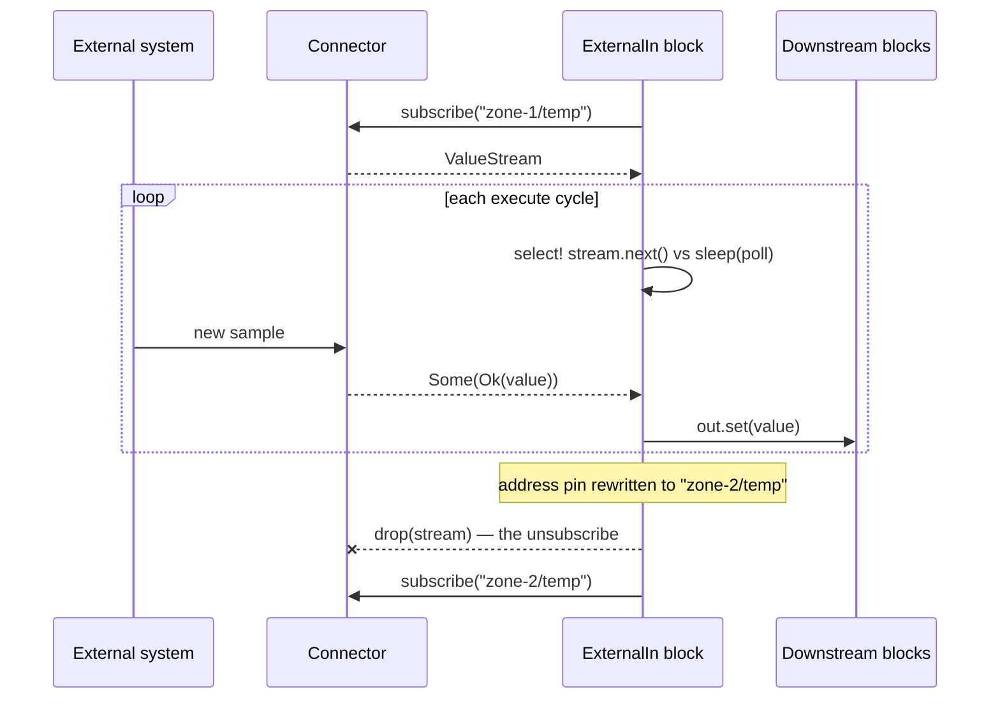

### 6.2 Outbound: graph → external system, under cancellation

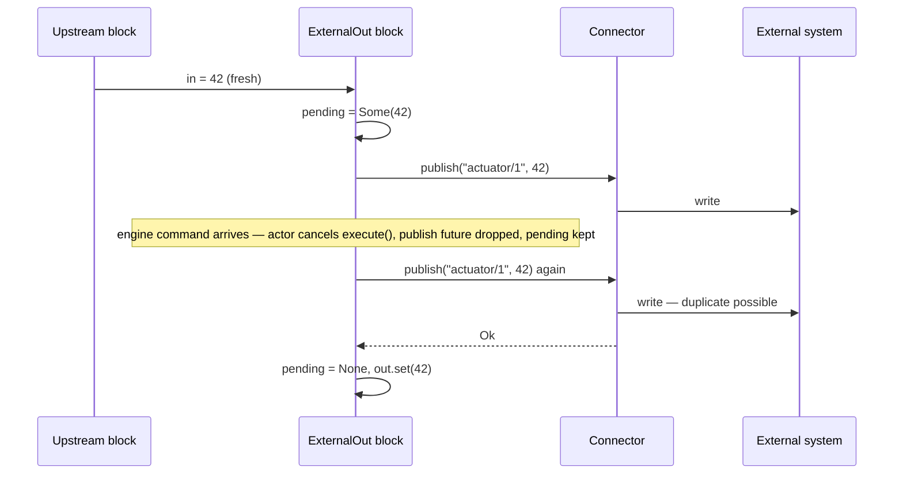

Delivery is **at-least-once**: a publish cancelled mid-flight may already have reached the external
system and will be sent again, so subscribers must tolerate duplicates.

### 6.3 Request/response with a deadline

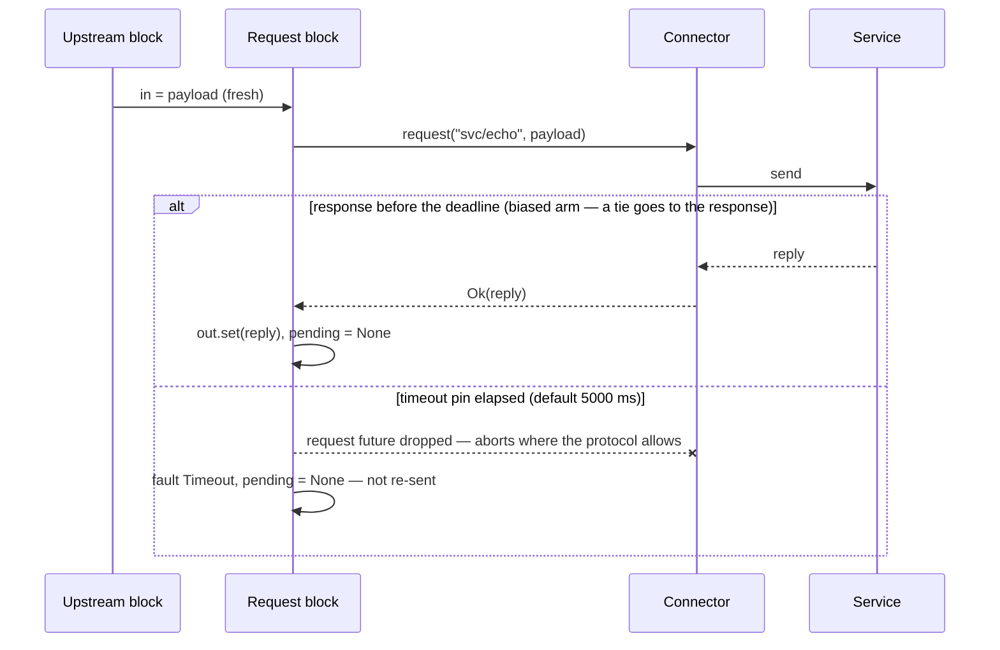

A **timeout** clears the pending value and does not retry; a **cancellation** from the actor mailbox
keeps it for the next cycle. Request handlers should therefore be idempotent, or deduplicate by key.

### 6.4 The wasm bridge: a JS `subscribe` as a Rust stream

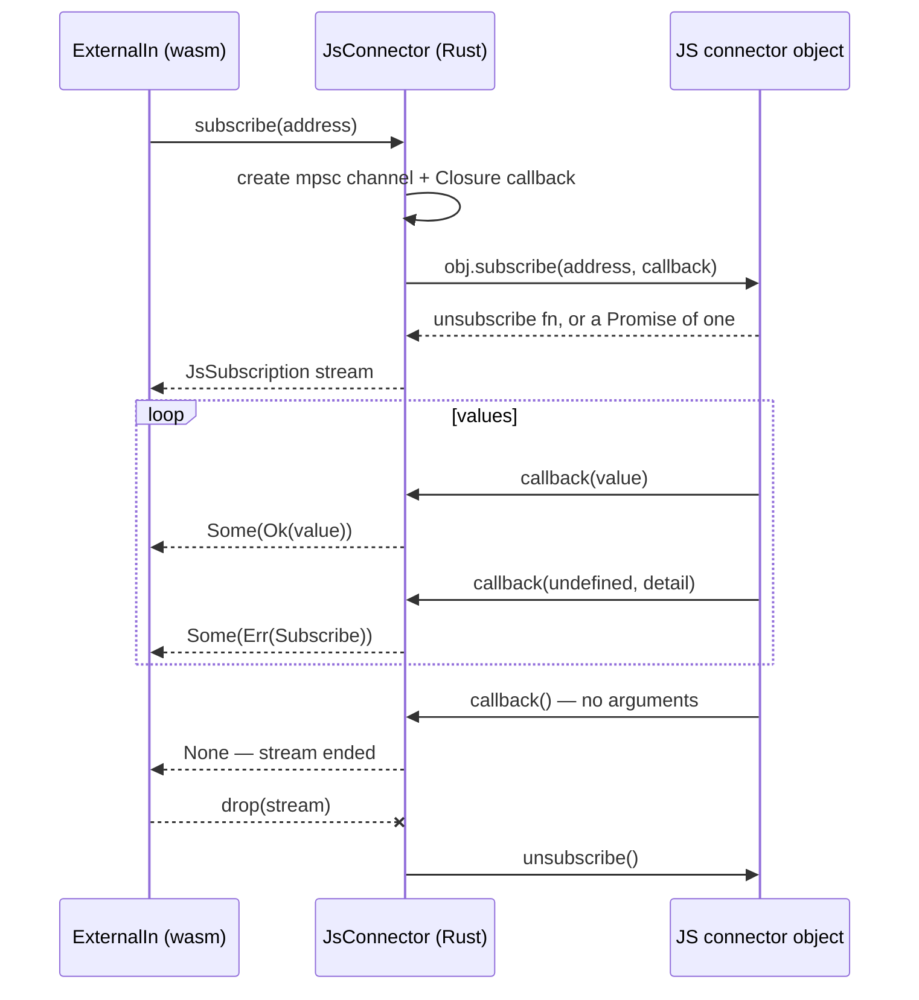

If the Rust `subscribe` future is dropped while the JS Promise is still pending, a `SubscribeCleanup`
guard attaches a `.then()` that invokes the eventual unsubscribe function and frees the callback, so
a cancelled subscribe cannot leak a live JS subscription.

## 7. Delivery semantics

| Path | Guarantee | Mechanism |
|---|---|---|
| `ExternalIn` | subscription survives a cancelled `execute()`; channel-backed streams lose nothing; auto-resubscribe after the stream ends | stream owned by `self`; `select!` against the poll interval |
| `ExternalOut` | **at-least-once** on cancel; a **timeout drops** the value with no retry; `Null` never publishes; a rebind never re-publishes | `select! { biased; ... }` with `pending` — kept on cancel, cleared on any completion |
| `Request` | **at-least-once** on cancel; a **timeout drops** the value with no retry; a response beats a simultaneous deadline | `select! { biased; ... }` with `pending` |
| Connector `start`/`stop` | bounded to 5 s each; failures logged, never fatal; `start` completes before any block runs | `tokio::select!` against `sleep_millis` |
| `Reset` / detach | no block can resolve a connector mid-stop | unregister **before** stop |
| JS callback contract | `callback()` with no arguments ends the stream — an accidental `undefined` does the same | `make_value_callback` |

## 8. Reference client: the web editor

The SvelteKit editor is the first consumer of this API and exercises every part of it. Its UI widgets
are not engine block types; each widget is a plain `ExternalIn` or `ExternalOut` bound to a
JavaScript-implemented connector named `ui`, addressed by its own block id, and carrying editor-only
metadata (`widget: { kind, config, configSources, valueSource }`) that the engine ignores.

| Module (`web/app/src/lib/`) | Role |
|---|---|
| `UiConnector.ts` | The `ui` connector. Input widgets call `pushValue(address, v)`; engine-side `ExternalIn` blocks subscribe. `ExternalOut` blocks publish; display widgets listen through `onValue(address, cb)`. Latest values are cached in both directions so late subscribers and late-mounting widgets see the current value. |
| `Widgets.ts` | Palette entries (`WidgetBlockDesc`), each `{ kind, direction: 'in' \| 'out', defaultConfig }`. Placing one creates the corresponding core block bound to `connector = 'ui'`. |
| `WidgetConfig.svelte.ts` | `useWidgetConfig` resolves live config overrides; `useValueFeedback` tracks a feedback address for input widgets. |
| `Program.ts` | Serialization of widget metadata, and migration of programs saved before this design (§9). |

### 8.1 Round trip: input widget → program → display widget

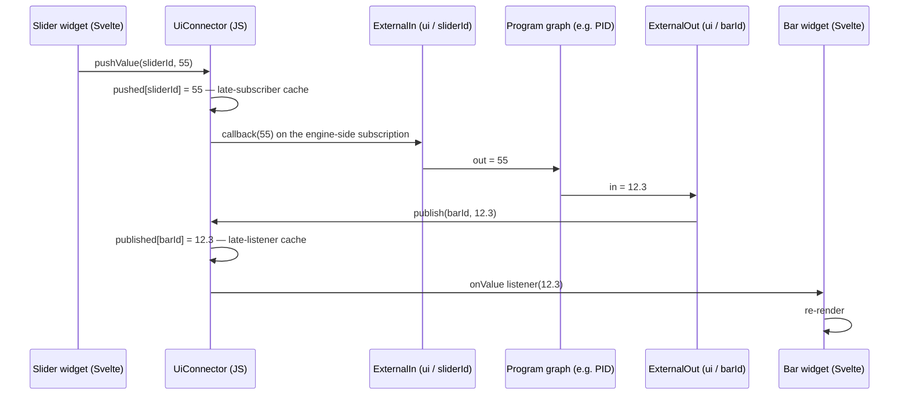

Two capabilities build on the same mechanism:

- **`configSources`** — a widget config key (a slider's `max`, a bar's range, a LED's label) may name
  the address of any plain `ExternalOut`. The live value then overrides the literal default.
- **`valueSource`** — an input widget may name an `ExternalOut` address whose published values it
  tracks as feedback, expressing the HMI idiom where a setpoint follows the program until an operator
  overrides it. Feedback is deferred while the user is interacting and applied on blur or release
  unless the user edited, and is never echoed back to the engine.

### 8.2 Run, reset, and pause

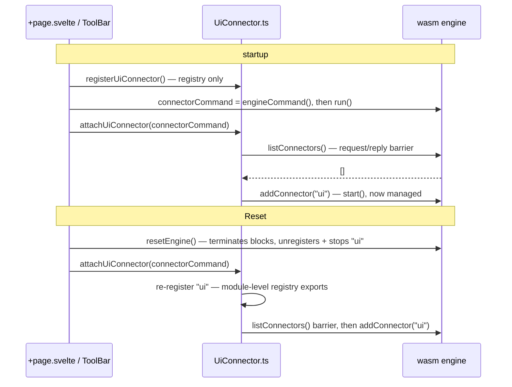

Every command handle used after startup is created **before** `engine.run()`: wasm-bindgen guards
exported objects with a `RefCell`, and the future `run()` returns holds the engine's mutable borrow
for as long as the engine lives, so any `engine.*` call from a promise continuation afterwards throws
("recursive use of an object detected"). Registration takes the same detour — `registerConnector`,
`unregisterConnector` and `connectorRegistered` are module-level exports against the process-wide
registry, not engine methods, so re-registering after a reset never touches the engine object.

`listConnectors()` doubles as an ordering barrier: engine messages are FIFO into a single queue
shared by every command handle, so its reply proves the engine has processed everything queued before
it, including a pending `Reset` sent through another handle. Attach attempts are serialized through a
promise chain so a mount-time attach and a reset-time attach cannot interleave their
check-then-attach sequences.

Because a paused engine drives no block actors, nothing drains the connector while paused. The editor
therefore gates UI pushes for the duration, updating only the latest-value cache and flushing one
value per touched address on resume.

## 9. Compatibility

Programs saved before this design store UI widgets as `lib: 'ui'` block entries. They are migrated in
place when loaded, inside `prepare(program)`, so the same migrated object is what later reaches
`pushToEngine`.

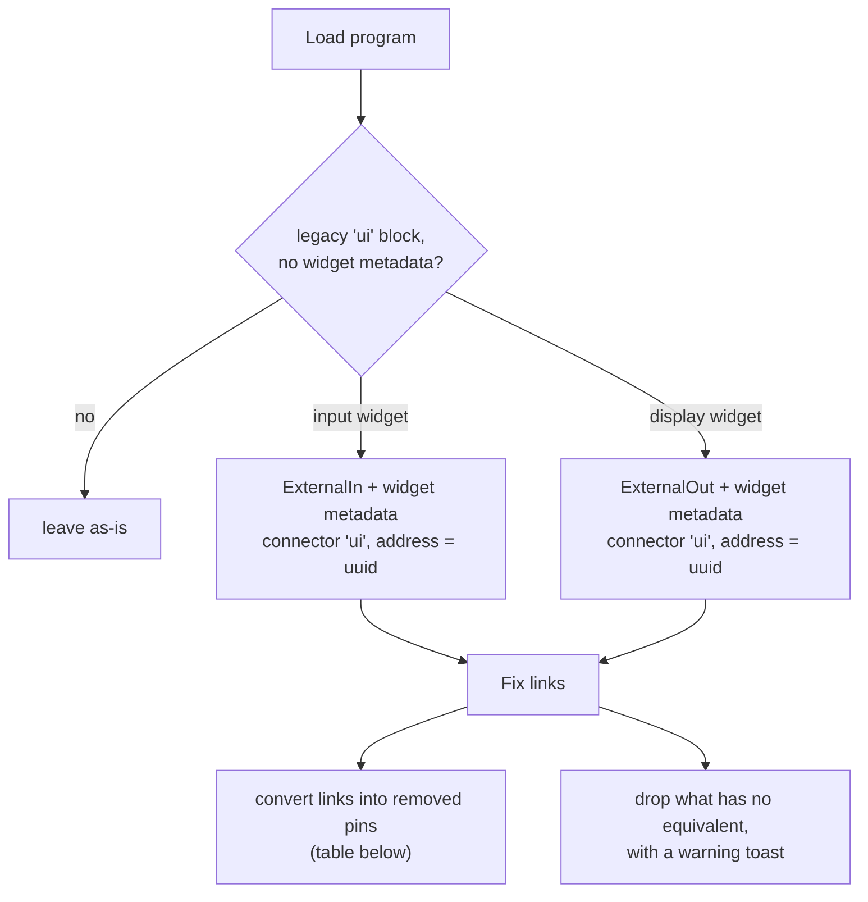

Input widgets are Slider, Input, Checkbox, Button, ComboBox and Table; display widgets are Gauge,
Chart, MultiChart, Label, Led, Bar and Display. Widget kind and config come from the old pins, and
the old cached `out` / `in` values carry over (MultiChart's value pin was `a`). A link into a removed
pin is converted — a plain `ExternalOut` block is synthesized, the link is retargeted to its `in`,
and the widget references its address — or, when nothing can carry it, dropped with a warning toast:

| Legacy link into | Carried forward as |
|---|---|
| a config pin (`min`, `max`, `step`, `label`, `color`, `unit`, ComboBox items) | synthesized `ExternalOut` address in `configSources[key]` |
| an input widget's `in` (program-driven value) | synthesized `ExternalOut` address as `valueSource` |
| MultiChart `a` | retargeted to `in` (no synthesis) |
| MultiChart `b` / `c` / `d` | synthesized `ExternalOut` address in `series[i]`; `labelB`/`C`/`D` literal kept as the series label |
| per-series label pins (nested config keys are not drivable), removed output pins | dropped, warning toast |

A link that used to feed a widget config pin (a `Bar`'s `min`, a `Led`'s `label`, the ComboBox
items) is not dropped: the migration synthesizes a plain `ExternalOut` on the `ui` connector — a
fresh uuid doubling as its address, placed next to the widget on the canvas — retargets the link to
its `in`, and records the address in the widget's `configSources`, so the linked value keeps driving
the config live. A link into an input widget's former value-drive pin becomes the widget's
`valueSource` the same way, and the old MultiChart data pins `b`/`c`/`d` each become an extra
`series[i].address` entry, carrying the corresponding `labelB`/`labelC`/`labelD` literal over as the
series label. Only what has no equivalent still drops — links into the per-series label pins (a
nested config key cannot be driven through the flat `configSources` map) and links from removed
output pins — and every drop surfaces as a warning toast when the program loads.

Two widget behaviours change as a consequence of the design:

- **`Gauge` becomes display-only.** It previously doubled as an input, which raced the wired writer
  on its own output.
- **`Input` and `ComboBox` lose their `in` pins.** Program-driven values flow through `valueSource`
  instead, which makes the precedence between program and operator explicit rather than a
  dual-writer race; the migration converts an old value-drive link into exactly that. (The old
  ComboBox `in` carried the CSV items list, so its link converts to a `configSources.items` drive
  instead.)

## 10. Consequences and constraints

- **Indirection cost.** A value crosses more layers than a direct pin write — for the editor,
  widget → connector → callback → wasm block → graph — and the coordination that requires
  (attach serialization, pause buffering, cache invalidation on block deletion) is real complexity
  traded for uniformity.
- **One engine per registered connector.** The registry carries no ownership mark, so attaching the
  same name to a second engine would double-start the connector, and one engine's reset would
  unregister it out from under the other.
- **Lifecycle timeouts are serial.** `run()` entry can block up to 5 s *per* hung connector, and a
  failing attach can hold the dispatch loop for up to two timeouts — a timed-out `start` followed by
  the cleanup `stop`.
- **At-least-once only.** Cancellation can duplicate an outbound publish or request; the design does
  not attempt deduplication, leaving idempotency to the external system.
- **Pause is not backpressure.** Pausing the engine stops block actors but not connector IO tasks, so
  an unbounded producer keeps producing. Clients that can pause must gate their own inbound pushes.

## 11. Implementing a connector

**Rust** — implement the trait and hand a handle to the engine. A full worked example lives in
`examples/connector_demo.rs`.

```rust
struct Echo;

impl Connector for Echo {
    fn subscribe(&self, address: &str) -> ConnectorFuture<'_, ValueStream> {
        let address = address.to_string();
        Box::pin(async move {
            let stream = futures::stream::iter([Ok(Value::make_str(&address))]);
            Ok(Box::pin(stream) as ValueStream)
        })
    }
    fn publish(&self, _address: &str, _value: Value) -> ConnectorFuture<'_, ()> {
        Box::pin(async { Ok(()) })
    }
    fn request(&self, _address: &str, value: Value) -> ConnectorFuture<'_, Value> {
        Box::pin(async move { Ok(value) })
    }
}

let mut engine = SingleThreadedEngine::new();
engine.add_connector("echo", ConnectorHandle::new(Echo))?;   // started when run() begins
```

**JavaScript** — a plain object, registered and then attached to the running engine.
The npm package wraps the ordering-sensitive start sequence shown below in
`startEngine()`; the raw sequence stays authoritative for what actually happens.

```ts
// Module-level export against the process-wide registry — safe to call at any
// time, even from a continuation after run() (engine methods are not).
registerConnector('sensors', {
  subscribe(address, callback) {
    const timer = setInterval(() => callback(readSensor(address)), 1000);
    return () => clearInterval(timer);          // called when the engine drops the stream
  },
  publish(address, value) { /* write toward the external system */ },
  request(address, value) { /* return a value or a Promise */ },
  // optional: start() / stop() — stop must end every stream with callback()
});

// Obtain the command handle *before* run(): `engine_command` takes `&mut self`, and the
// future returned by `run()` holds that borrow for as long as the engine is running.
const command = engine.engineCommand();

// Commands are only serviced from inside the engine's message loop, so start it first.
engine.run();

const id = await command.addBlock('ExternalIn');
await command.writeBlockInput(id, 'connector', 'sensors');
await command.writeBlockInput(id, 'address', 'zone-1/temp');

await command.addConnector('sensors');        // attach: start() + engine-managed from here
```

That manual sequence is easy to get wrong — a handle minted after `run()` trips
the wasm borrow guard, a command awaited before `run()` deadlocks — so the npm
package owns it in `startEngine()` (and `createEngineSession()` for hosts that
must create handles at module load but start the engine later). The example
above, with the wrapper:

```ts
import { registerConnector, startEngine } from 'logic-mesh';

registerConnector('sensors', { subscribe, publish, request });

// Engine created, handles pre-created, message loop running.
const { command } = startEngine();

const id = await command.addBlock('ExternalIn');
await command.writeBlockInput(id, 'connector', 'sensors');
await command.writeBlockInput(id, 'address', 'zone-1/temp');

await command.addConnector('sensors');
```

The returned session also carries a dedicated `connectorCommand` handle for
attach flows, `watch()` backed by pre-created handles (a watch permanently
occupies one, and none can be created after start), and `reset()`/`stop()`
routed through an internal control handle so they never collide with a
caller's in-flight command.

Finally, when the external system is just a set of request/response functions,
`defineJsBlocks` skips the connector boilerplate entirely: it registers one
connector whose addresses are JS function names, and materializes each call
site as a `Request` block — argument on `in`, awaited result on `out`,
rejections as block faults, the `timeout` pin bounding functions that never
settle.

```ts
import { defineJsBlocks, startEngine } from 'logic-mesh';

const session = startEngine();
const jsBlocks = defineJsBlocks({ scale: (value) => (value as number) * 2 });
await jsBlocks.attach(session.command);

const id = await jsBlocks.addBlock(session.command, 'scale');
await session.command.writeBlockInput(id, 'in', 21); // out becomes 42
```

`defineJsBlocks` complements — it does not replace — the pre-existing
`registerBlock` path for JS-implemented block types. The two serve different
shapes, and both stay:

- **`defineJsBlocks`** for logic the graph calls with one value: a single `in`
  and `out` through a `Request` block, attachable to a *running* engine, a
  `timeout` pin, and at-least-once retry when the block actor cancels a call
  mid-flight. Several inputs travel as one dict on the `in` pin.
- **`registerBlock`** for real block types: several independently linkable
  input pins, per-pin kinds (and, through `defineBlock`'s schema layer,
  defaults — raw `registerBlock` pins carry name and kind only), an entry in
  the block library.
  Registration happens before the engine runs, and the block executes inside
  the actor like any built-in.
- A **full connector** whenever values flow on their own schedule — streams in
  (`subscribe`/`ExternalIn`), sinks out, whole protocols.

The npm package README carries the same guidance as a decision table.
